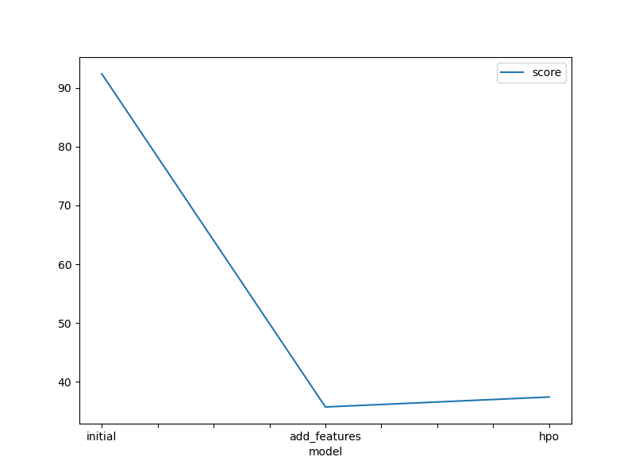
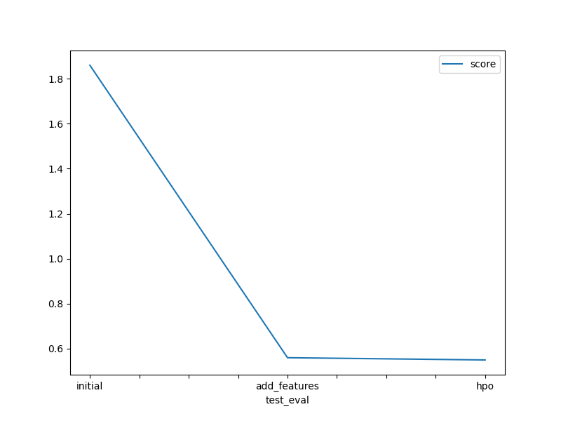

# Report: Predict Bike Sharing Demand with AutoGluon Solution
#### Ting Lu

Visit the [Kaggle Bike Sharing Demand Competition](https://www.kaggle.com/c/bike-sharing-demand) page. There you will see the overall details about the competition including overview, data, code, discussion, leaderboard, and rules.

## Initial Training
### What did you realize when you tried to submit your predictions? What changes were needed to the output of the predictor to submit your results?

When submitting predictions from all five experiments, some produced negative values. Kaggle rejects submissions with negative predictions and replaces any such outputs with 0.

### What was the top ranked model that performed?

The top-performing model, named WeightedEnsemble_L2, showcased exceptional performance with a validation RMSE score of 35.4 and the highest Kaggle score of 0.56 on the test dataset. This model was meticulously crafted through a process involving exploratory data analysis (EDA) and feature engineering, without resorting to hyperparameter optimization. Despite attempts to improve performance through hyperparameter optimization for other models, WeightedEnsemble_L2 consistently outperformed them on unseen test data. It's worth noting that while several models demonstrated competitive performance, the selection of WeightedEnsemble_L2 was based on its superior performance across both cross-validated RMSE and Kaggle test data scores

## Exploratory data analysis and feature creation
### What did the exploratory analysis find and how did you add additional features?

- `Datetime` feature was parsed to extract hour information.
- Initially integer features `season` and `weather` were converted to categorical variables.
- `Year`, `month`, `day` (`dayofweek`), and `hour` were extracted as independent features from `datetime`, then `datetime` was dropped.
- Features `casual` and `registered` showed significant improvement in RMSE scores during cross-validation but were ignored/dropped during model training due to absence in test data.
- A categorical feature `day_type` was created based on `holiday` and `workingday` to categorize "weekday", "weekend", and "holiday".
- Due to high correlation (0.98) between `temp` and `atemp`, `atemp` was dropped to reduce multicollinearity.

### How much better did your model preform after adding additional features and why do you think that is?

The adding features model reduced RMSE by approximately 60% in comparison to the raw model without feature engineering.

## Hyper parameter tuning
### How much better did your model preform after trying different hyper parameters?

Hyperparameter tuning improved the model's performance compared to its raw model. Despite the competitive performances of the hyperparameter-tuned models, the adding features model demonstrated better performance on the Kaggle test dataset.

Autogluon training considers preset settings, but optimizing model performance is limited due to fixed user-provided hyperparameters. "time_limit" and "presets" are crucial for hyperparameter optimization in Autogluon. Options like "high_quality" require high memory usage and are computationally intensive, while lighter options like "medium_quality" and "optimized_for_deployment" are also explored. Choosing the faster, lighter option of "optimized_for_deployment" for hyperparameter optimization is preferred in experimental setups as it successfully creates AutoGluon models within specified constraints, highlighting the challenge between exploration and deployment when using AutoGluon.

### If you were given more time with this dataset, where do you think you would spend more time?

I aim to extend the runtime of AutoGluon with a high-quality preset and explore more hyperparameter tuning. This approach seeks to uncover whether prolonging the training duration and refining hyperparameter tuning could yield further improvements in model performance and uncover hidden patterns or relationships within the data.

### Create a table with the models you ran, the hyperparameters modified, and the kaggle score.
|model|hpo1|hpo2|hpo3|score|
|--|--|--|--|--|
|initial|default values|default values|presets:  medium_quality_faster_train|1.86|
|add_features|default values|default values|presets:  medium_quality_faster_train|0.56|
|hpo|GBN|NN|presets: best quality|0.55|

### Create a line plot showing the top model score for the three (or more) training runs during the project.

  

### Create a line plot showing the top kaggle score for the three (or more) prediction submissions during the project.

  

## Summary

 - The AutoGluon AutoML framework for Tabular Data played a pivotal role in this bike sharing demand prediction project. It was thoroughly studied and integrated, allowing for the creation of automated stack ensembles and individually configured regression models trained on tabular data. This framework expedited the prototyping of a base-line model.

 -  Top-performing AutoGluon-based model demonstrated significant improvement by incorporating data derived from extensive exploratory data analysis (EDA) and feature engineering, without employing hyperparameter optimization. Leveraging automatic hyperparameter tuning, model selection/ensembling, and architecture search enabled AutoGluon to explore and exploit the best possible options.

 - However, despite offering improved performance over the initial raw submission, hyperparameter tuning using AutoGluon did not surpass that of the model crafted with EDA and feature engineering but without hyperparameter tuning. It became apparent that hyperparameter tuning using AutoGluon, especially without default hyperparameters or random configuration of parameters, proved to be a cumbersome process. It was highly dependent on factors such as time limits, prescribed presets, possible families of models, and the range of hyperparameters to be tuned.
